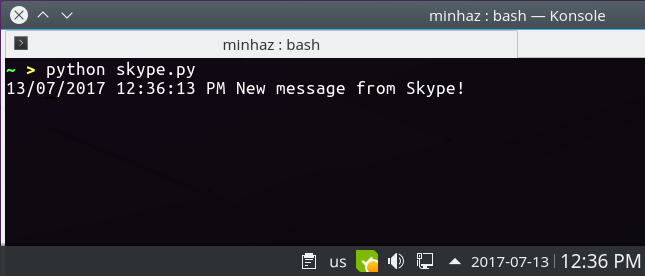

# Skype4Linux Notifier

This might be the dumbest script I have ener written. The script look for Skype unseen message icon in the system tray of your desktop, and notifies if there is any unread message available.

## TODO

- [ ] Add dbus/http/mqtt notifier
